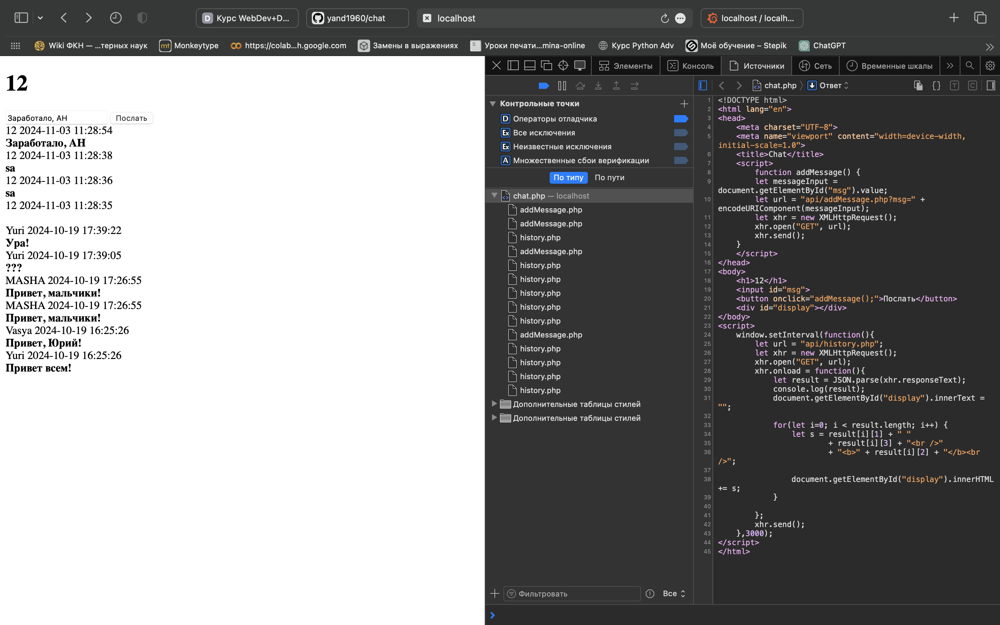

### Отчет об изменениях (diff) для PHP-чата

#### 1. `api/addMessage.php`
   - **Добавлен вывод ошибок для отладки**:
     ```php
     +ini_set('display_errors', 1);
     +ini_set('display_startup_errors', 1);
     +error_reporting(E_ALL);
     ```
     Эти строки включают отображение ошибок, что помогает при отладке кода, показывая все ошибки и предупреждения в процессе разработки.

#### 2. `chat.php`
   - **Исправлен JavaScript-код в функции `addMessage`**:
     - Было:
       ```javascript
       let url = "/example/api/addMessage.php?msg=" 
                  + document.getElementById("msg").value;
       let xhr = new XMLHttpRequest();
       xhr.open("GET", url);
       xhr.send();
       ```
     - Стало:
       ```javascript
       let messageInput = document.getElementById("msg").value;
       let url = "api/addMessage.php?msg=" + encodeURIComponent(messageInput);
       let xhr = new XMLHttpRequest();
       xhr.open("GET", url);
       xhr.send();
       ```
     Изменения обеспечивают правильное получение и кодирование значения сообщения из поля ввода `msg`.

   - **Обновлена ссылка для API в `setInterval`**:
     - Было:
       ```javascript
       let url = "/example/api/history.php";
       ```
     - Стало:
       ```javascript
       let url = "api/history.php";
       ```
     Убрано `/example/` из URL для правильного пути к API.

#### 3. `dal/chatdb.php`
   - **Исправлено имя базы данных**:
     - Было:
       ```php
       $conn = new mysqli("localhost","root","","chat_example");
       ```
     - Стало:
       ```php
       $conn = new mysqli("localhost","root","","chat");
       ```
     Имя базы данных изменено на `chat`.

   - **Исправлено название колонки `User` на `UserName`**:
     - Было:
       ```php
       $sql = "INSERT INTO messages(User, Message)
               VALUES('$user','$message')";
       ```
     - Стало:
       ```php
       $sql = "INSERT INTO messages(UserName, Message)
               VALUES('$user','$message')";
       ```
     Замена `User` на `UserName`, устраняя ошибку "Unknown column 'User'".

### Резюме
Внесенные изменения исправляют проблемы с базой данных, путями API и передачей данных, что позволяет приложению работать корректно:
